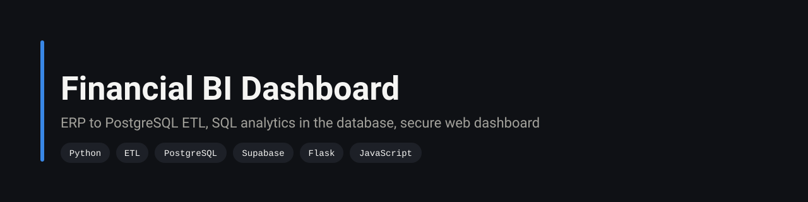
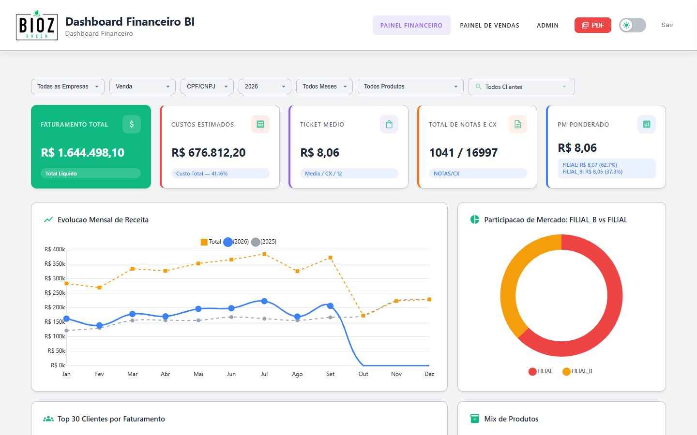
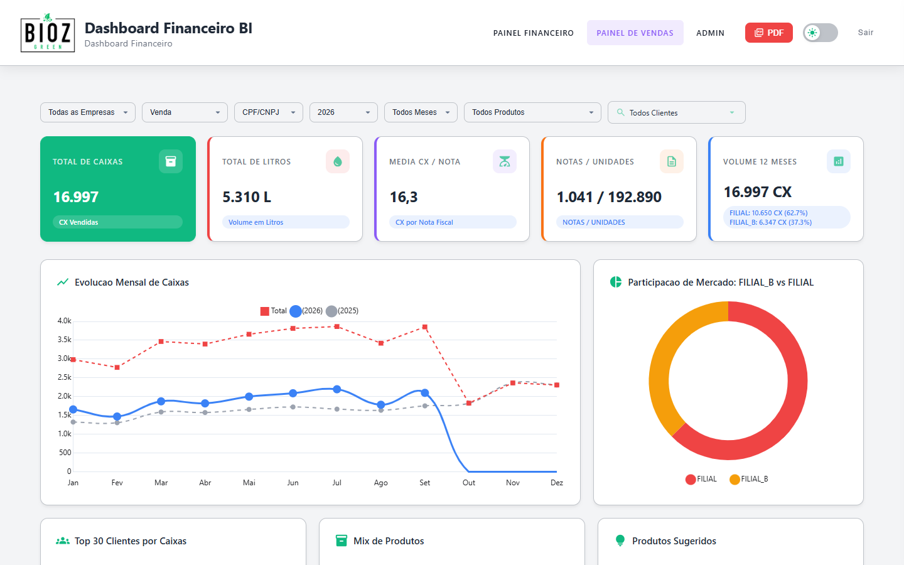
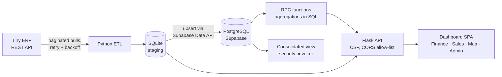

<p align="center">
  
</p>

<p align="center">
  
  
  
  
  
</p>

> The finance team closed every month by exporting ERP reports into spreadsheets and reconciling two companies by hand. This project replaced that with an ETL pipeline, SQL analytics running inside PostgreSQL, and a dashboard the directors open in the browser.

<table>
<tr>
<td align="center"><b>~60%</b><br/>less time to close the month</td>
<td align="center"><b>~80%</b><br/>of recurring reports automated</td>
<td align="center"><b>2</b><br/>companies consolidated in one view</td>
<td align="center"><b>~7,900</b><br/>lines of Python, SQL and JS</td>
</tr>
</table>

<sub>The first two figures were measured in the company's production deployment, comparing the monthly close before and after. This repository is the study version: credentials and real data were removed, and the screenshots below run on synthetic demo data.</sub>



<details>
<summary>Sales dashboard</summary>



</details>

## The problem

A manufacturer of cosmetics and cleaning products runs two companies on the same ERP (Tiny ERP). Every month, sales and invoices were exported from both, cleaned in spreadsheets and cross-checked by hand. Reports disagreed with each other, and the directors saw consolidated numbers days after the month ended.

## The solution



The ETL pulls month by month per company and checks whether a month is already loaded before fetching it again, so a rerun after a failure picks up where it stopped. Data lands in SQLite first, which keeps the pipeline working offline and gives a staging copy to validate. It is then upserted into PostgreSQL on Supabase.

The heavy lifting happens in the database. Three RPC functions (`get_dashboard_completo`, `get_vendas_uf`, `get_vendas_volume`) take up to a dozen optional filters (company, period, product, customer, state, category, weekday) and return ready-to-plot JSON, so the browser never downloads raw rows.

## Technical highlights

| Area | What was done |
|---|---|
| Resilient extraction | `safe_request` retries timeouts and connection errors with growing waits, and backs off for 60 s on rate limits. Month-level idempotency check before every load. |
| Normalization | Dates in multiple ERP formats, CPF/CNPJ to person type (individual or company), box-to-unit conversion, product categories and naming mapped across both companies. |
| SQL analytics | Consolidated multi-company view plus RPC functions that aggregate, rank customers and filter inside Postgres. |
| Database security | Views switched from `SECURITY DEFINER` to `security_invoker`, Row Level Security on 6 tables with per-table policies, all privileges revoked from the `anon` role (`sql/security_emergency_fix.sql`). |
| API security | Content Security Policy, `X-Frame-Options: DENY` and a CORS allow-list on every response. |
| Frontend | Plain JavaScript SPA with its own router, login, and Finance, Sales, Map (sales by state) and Admin pages. |

## Run it

With synthetic demo data, no ERP needed:

```bash
pip install -r requirements.txt
python scripts/db/seed_demo.py          # 2 companies, 24 months, ~6.5k sale lines
python api/server.py                    # http://localhost:5000, any email logs in (demo auth)
```

Against the ERP:

```bash
pip install -r requirements.txt
cp .env.example .env                    # database path and ERP tokens
python scripts/db/init_sqlite_schema.py
python scripts/etl/coleta_tiny.py       # load from the ERP
python api/server.py                    # API + dashboard at http://localhost:5000
```

## Project structure

```
api/          Flask API: /api/dados, /api/vendas, /api/mapa, /api/status
frontend/     SPA: router, auth, Finance, Sales and Admin pages
scripts/etl/  ERP extraction and sync to Supabase
scripts/db/   SQLite schema, refresh jobs and demo data seed
sql/          Migrations, RPC functions and the security hardening script
```

## Engineering decisions

| Decision | Why |
|---|---|
| SQLite staging before Postgres | The ERP API is slow and rate limited. A local copy means a failed sync to the cloud never forces a new extraction, and data can be checked before it is published. |
| Aggregate in SQL, not in Python or the browser | The dashboard sends filters and receives a few hundred numbers instead of tens of thousands of rows. |
| Row Level Security plus revoking `anon` | Supabase exposes tables through a public API. Without RLS, anyone with the project URL and anon key could read sales data. The hardening script closes that. |
| Plain JavaScript frontend | Few screens and no build step, which made deployment on the company server simple. |

## Production version

The version running at the company went further than this repository: incremental ETL, PostgreSQL 16 with materialized views, Flask behind Nginx with SSL, all in Docker on a VPS I administer.

## Limitations

- No automated tests in this study version.
- Nothing in this repository schedules the ETL or alerts on failures; it is run by hand or by an external scheduler.
- Two versions of the RPC functions coexist in `sql/`; `rpc_functions_v2.sql` is the current one.

## Author

**Silvano Moraes de Souza**, Software Engineer · Python, APIs, automation and data in production
[LinkedIn](https://www.linkedin.com/in/silvano-moraes-de-souza) · [Portfolio](https://silvanomsouza.vercel.app/) · [GitHub](https://github.com/silvano-moraes-de-souza)
